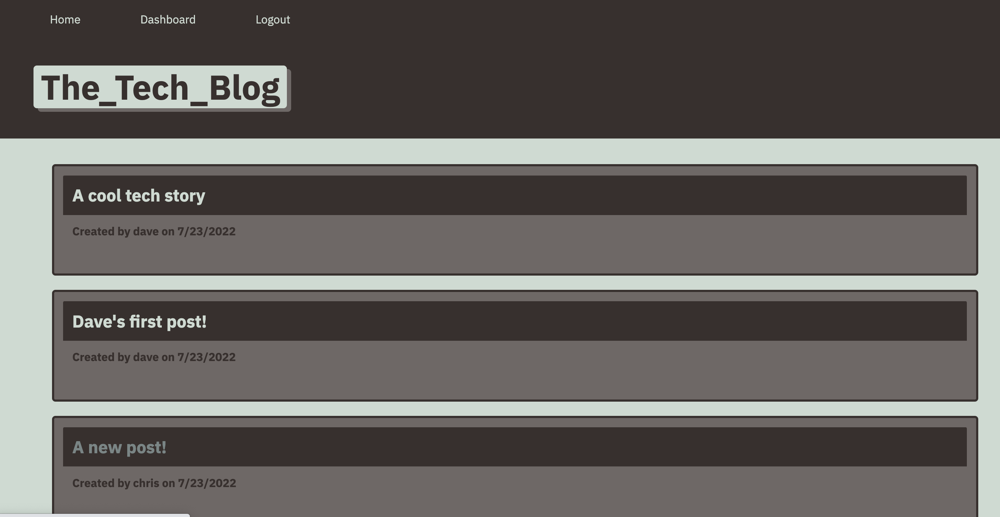
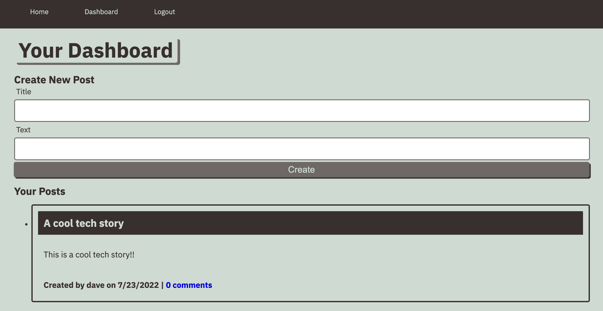
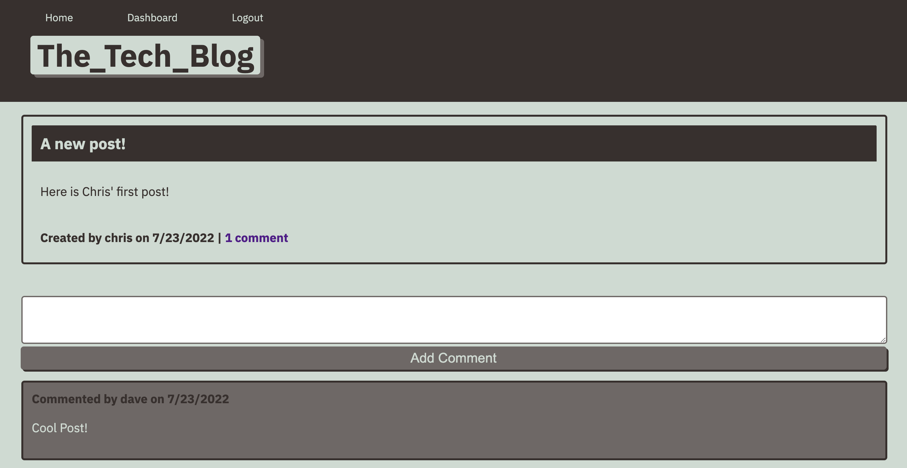
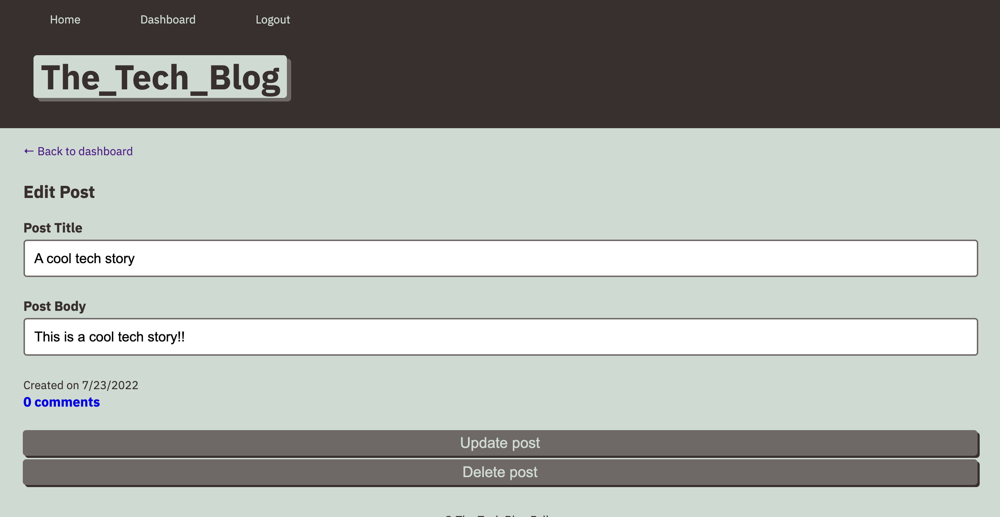
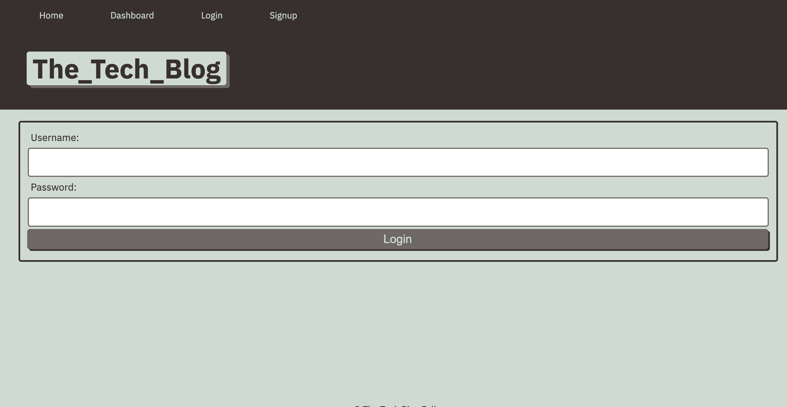

# tech-blog#

## Description
This full-stack application is a blog that allows users to GET posts from other users.  Once signed in users can CREATE a new post, EDIT their posts, DELETE their posts, and comment on other user's posts.

* Created with node.js, express.js, sequelize, MySQL, handlebars.js, express session, connect session sequelize, bcrypt, and dotenv.  Development also used Insomnia for testing routes.  

## Installation/Directions
If using to code for education/production, first install required dependencies by running "npm install" in the command line.  Fill in your MySQL username and password into the .env.EXAMPLE file and be sure to rename it ".env".  Then run MySQL by typing "mysql -u root - p" and enter your password.  Type "SOURCE db/schema.sql" and then "USE tech_blog_db".  Exit the MySQL shell by typing "quit".  Next populate the database by running the command "npm run seed".  Start the server with the command "npm start".  Open insomnia and operate the routes using http://localhost:3001/api/... 
* api/user
* api/post
* api/comment

## Application

The app is deployed at https://dashboard.heroku.com/apps/obscure-stream-37468

##  Screenshots

Home Page

 

Dashboard

 

Comments

 

Edit Post

 

LogIn

 

## Contributions
Created by Chris Hodges, starter code provided by UNC Bootcamp.

## Questions
For any questions, contact me at chrisdhodges12@gmail.com or find me on GitHub at https://github.com/chrisdhodges12
